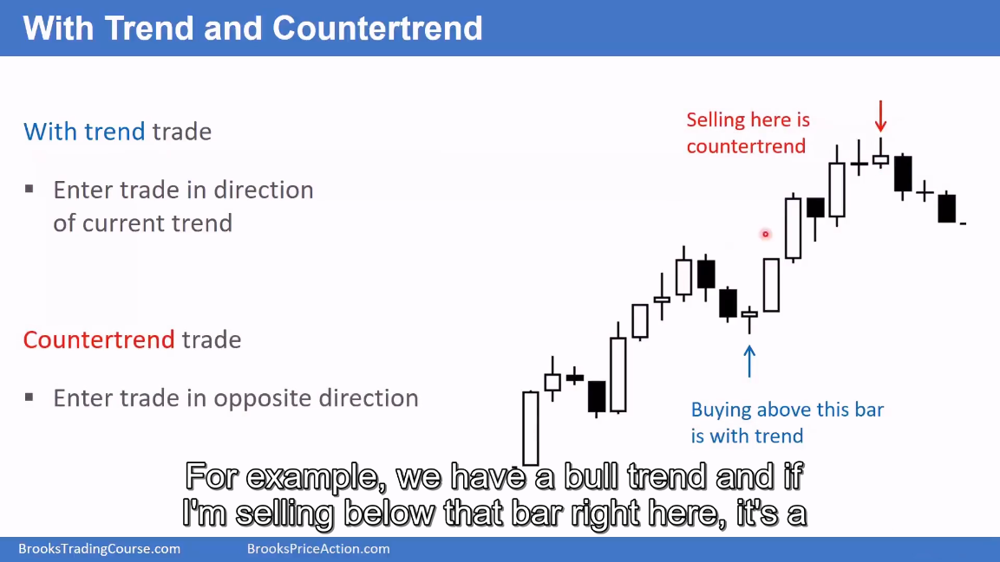
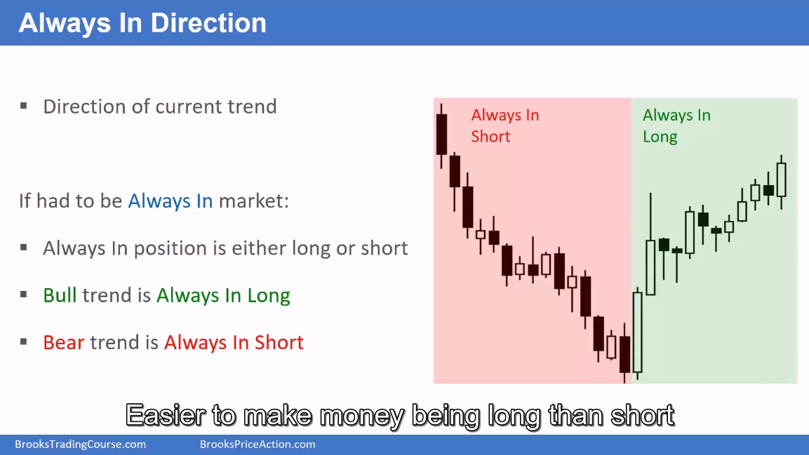

# 01. 术语 (Terminology)

本章节介绍 Al Brooks 价格行为交易体系中的核心术语和概念，为后续学习打下基础。

---

---

## 1. 缩写术语表

| 缩写 | 全称 | 中文解释 |
|------|------|----------|
| AIL | Always In Long | 始终做多 |
| AIS | Always In Short | 始终做空 |
| B | Buy | 买入 |
| BLSHS | Buy Low, Sell High, Scalp | 低买高卖，剥头皮 |
| BO | BreakOut | 突破 |
| C | Close | 收盘 |
| DB | Double Bottom | 双底 |
| DT | Double Top | 双顶 |
| EMA | Exponential Moving Average | 指数移动平均线 |
| H | High | 高点 |
| HFT | High Frequency Trading | 高频交易 |
| HH | Higher High | 更高高点 |
| HL | Higher Low | 更高低点 |
| L | Low | 低点 |
| LH | Lower High | 更低高点 |
| LL | Lower Low | 更低点 |
| MA | Moving Average | 移动平均线 |
| MAG | Moving Average Gap bar | 均线缺口K线 |
| MM | Measured Move | 等距移动/测量移动 |
| MTR | Major Trend Reversal | 主要趋势反转 |
| OOD | Open Of Day | 日开盘价 |
| PB | PullBack | 回调 |
| S | Sell | 卖出 |
| TBTL | Ten Bars, Two Legs correction | 十K线两腿修正 |
| TR | Trading Range | 交易区间 |
| TTR | Tight Trading Range | 窄幅交易区间 |

---

## 2. 图表价格增量 (Chart Price Increments)

上图展示了交易中常用的价格计量单位：

| 术语 | 英文 | 说明 |
|------|------|------|
| **Tick** | Tick | 股票或期货图表上的最小变动单位 |
| **Pip** | Pip | 外汇图表上的最小变动单位 |
| **Point** | Point | 一组Tick或Pip的集合 |
| **Lot** | Lot | 交易的手数/规模 |
| **Handle** | Handle | 价格的整数部分（大整数） |

---

## 3. 市场状态

任何给定时间，市场都处于以下两种状态之一：

- **趋势 (Trend)** - 价格朝一个方向持续移动
- **交易区间 (Trading Range)** - 价格在支撑和阻力之间震荡

上图展示了市场的完整演变过程：

1. **牛市趋势以突破开始** (Bull trend begins with breakout) - 强劲的上涨突破启动趋势
2. **回调形成趋势通道起点** (Pullback, so start of trend channel) - 第一次回调后形成上升通道
3. **通道是牛市趋势的较弱部分** (Channel is weaker part of bull trend) - 通道内上涨动能减弱，价格沿通道缓慢爬升
4. **通道演变为交易区间** (Channel evolves into Trading Range) - 趋势减弱转为横盘震荡，进入交易区间
5. **交易区间最终突破** (Trading Range eventually breaks out) - 区间结束，价格选择方向突破
6. **趋势可能继续向上或反转向下** (Trend can resume up or reverse down) - 突破后可能延续原趋势上涨，也可能反转向下

---

### 趋势反转的类型

#### 次要趋势反转 (Minor Trend Reversal)

**特点：**
- 通常是交易区间内的一腿 (leg in trading range)
- 逆势回调后，原趋势恢复
- 例如：熊市趋势出现回调，然后熊市趋势继续

#### 主要趋势反转 (Major Trend Reversal)

**熊市转牛市：**
- 熊市趋势完全转变为牛市趋势
- 价格突破下降通道，形成新的上升趋势
- 这是重要的交易机会

**牛市转熊市：**
- 牛市趋势完全转变为熊市趋势
- 价格跌破上升通道，形成新的下降趋势
- 注意：小的反转可能只是形成牛市旗形 (bull flags)，而非真正的趋势反转

---

## 3. 支撑与阻力

上图展示了支撑和阻力在图表中的实际表现：

**支撑位 (Support)** - 图中底部绿色区域：
- 位于当前价格下方的价位
- 当价格下跌到此区域时，抛售可能暂停或反转
- 图表显示价格在绿色支撑位多次获得支撑后反弹

**阻力位 (Resistance)** - 图中顶部红色区域：
- 位于当前价格上方的价位
- 当价格上涨到此区域时，上涨可能停滞或反转
- 图表显示价格在红色阻力位遇阻后回落

---

## 4. 突破 (Breakout)

### 定义

价格移动到支撑或阻力之外。

### 突破后的可能结果

**可能失败：**
- 回到交易区间

**可能成功：**
- 形成趋势

---

## 5. K线与蜡烛

### 术语说明

- 使用**蜡烛图 (Candle Charts)**
- 有时也称为**K线 (Bars)**
- **Tail / Wick / Shadow** - 都是指影线（同一个意思）

### 两种K线类型

#### 趋势K线 (Trend Bars)

- 小影线（影线短）
- 单根K线就是一个趋势

#### 交易区间K线 (Trading Range Bars)

- 也称为**十字星 (Dojis)** 或 **Doji Bars**
- 影线明显，实体小
- 单根K线就是一个交易区间

---

### 剥头皮与波段交易 (Scalp vs Swing)

**剥头皮交易 (Scalp)：**
- 计划快速获利
- 通常在1-5根K线内离场
- 示例：在图中绿色位置买入，在红色位置离场（剥头皮）

**波段交易 (Swing)：**
- 计划持仓只要趋势持续
- 示例：在图中绿色位置买入，在蓝色位置离场（波段）

---

**日线图表上的区别：**

| 类型 | 剥头皮交易者 (Scalper) | 波段交易者 (Swing Trader) |
|------|----------------------|------------------------|
| **身份** | 交易者/快钱交易者 | 投资者 |
| **目标** | 快速获利 | 持仓至趋势结束 |
| **持仓时间** | 通常1-5天 | 有时数月到数年 |

**示例解读：**
- 剥头皮交易者和波段交易者在同一位置（绿色箭头）买入
- 剥头皮者在蓝色位置获利离场
- 波段交易者一直持仓到橙色位置才获利离场

---

## 6. ABC回调

### 移动平均线 (Moving Average)

**默认设置：**
- **20周期指数移动平均线 (20 bar Exponential Moving Average, EMA)**
- 通常简称为 **MA** 或 **EMA**

**用途：**
- 判断趋势方向：价格在EMA上方通常为牛市，下方为熊市
- 识别支撑/阻力位：EMA经常作为动态支撑或阻力
- 过滤交易：只交易与EMA方向一致的交易

---

### Setup（设置/形态）

**定义：**
- **图表形态 (Chart pattern)** - 一种特定的价格走势形态
- **一根或多根K线** 组成的模式
- 让你相信交易将会盈利的形态

**示例 - 买入设置 (Buy Setup)：**
- 牛市趋势中的回调 (Pullback in bull trend)
- 价格回调至支撑区域，形成可能的买入机会

---

### 入场K线与信号K线 (Entry Bar & Signal Bar)

**入场K线 (Entry Bar)：**
- 你进入交易的那根K线
- 订单在该K线执行成交

**信号K线 (Signal Bar)：**
- 入场K线前的那根K线
- 是你决定交易的理由
- 是给你"信号"要入场的K线

**示例：**
- 信号K线：出现看涨形态，给你做多信号
- 入场K线：下一根K线，你在其高点上方设置买入止损单

---

### 机构 (Institutions)

**定义：** 任何进行交易的公司或组织

**主要类型：**

| 类型 | 说明 |
|------|------|
| **银行 (Banks)** | 如高盛 (Goldman Sachs)、美国银行 (Bank of America) |
| **对冲基金 (Hedge funds)** | 专业的投资管理公司 |
| **高频交易公司 (HFT firms)** | 使用算法进行高速交易 |
| **养老基金 (Pension funds)** | 如 CalPERS（加州公共雇员退休系统）|
| **共同基金 (Mutual funds)** | 如富达 (Fidelity) |
| **大型个人交易者** | 资金量大的个人投资者 |

**重要性：**
- 机构是市场的主要推动力量
- 他们的买卖行为创造支撑和阻力
- 理解机构行为有助于预测价格走势

---

### 牛市趋势中的ABC回调 (High 2)

- 在牛市趋势中，寻找 **High 2 (H2)** 回调
- 在信号K线高点上方设置买入止损单

### 熊市趋势中的ABC回调 (Low 2)

- 在熊市趋势中，寻找 **Low 2 (L2)**
- 在信号K线低点下方设置卖出止损单

---

### 顺势交易与逆势交易 (With Trend vs Countertrend)

#### 顺势交易 (With Trend Trade)

**定义：** 按照当前趋势方向进行交易

**特点：**
- 在牛市趋势中买入（做多）
- 在熊市趋势中卖出（做空）
- 成功率较高，风险相对较小
- 是推荐的交易方式

**示例：**
- 在牛市中，当价格回调到支撑区域时买入
- "在该K线上方买入是顺势交易"

#### 逆势交易 (Countertrend Trade)

**定义：** 与当前趋势方向相反进行交易

**特点：**
- 在牛市趋势中卖出（做空）
- 在熊市趋势中买入（做多）
- 成功率较低，风险较大
- 需要更强的确认信号

**示例：**
- 在牛市顶部尝试做空
- "在这里卖出是逆势交易"

---

## 7. 内外K线

### 内包K线 (Inside Bar)

- 高点等于或低于前一根K线的高点
- 低点等于或高于前一根K线的低点

### 外包K线 (Outside Bar)

- 高点等于或高于前一根K线的高点
- 低点等于或低于前一根K线的低点

---

### 详细定义

#### 内包K线 (Inside Bar)

**定义条件：**
- 当前K线的高点等于或低于前一根K线的高点
- 当前K线的低点等于或高于前一根K线的低点

**特点：**
- 完全包含在前一根K线的价格范围内
- 表示市场不确定性增加，波动性减小
- 通常是趋势暂停或盘整的信号
- 在趋势中，内包K线可能是趋势延续的信号

#### 外包K线 (Outside Bar)

**定义条件：**
- 当前K线的高点等于或高于前一根K线的高点
- 当前K线的低点等于或低于前一根K线的低点

**特点：**
- 完全包含前一根K线的价格范围
- 表示市场波动性增加，力量增强
- 可能是趋势反转或加速的信号
- 外包K线后的K线方向通常很重要

---

### 始终在场方向 (Always In Direction)

**定义：** 当前趋势的方向，表示如果必须始终在场交易，应该持有什么方向的头寸。

**核心概念：**

| 市场状态 | Always In 方向 | 说明 |
|----------|----------------|------|
| **牛市趋势 (Bull trend)** | Always In Long | 始终做多，只考虑买入机会 |
| **熊市趋势 (Bear trend)** | Always In Short | 始终做空，只考虑卖出机会 |

**如何判断 Always In 方向：**

1. **观察趋势方向**
   - 价格在EMA上方且上涨 = Always In Long
   - 价格在EMA下方且下跌 = Always In Short

2. **寻找反转信号**
   - 当 Always In 方向改变时，通常有重要的趋势反转信号
   - 如：连续多根同向K线、突破关键支撑/阻力等

**交易应用：**

- **顺势交易：** 只交易与 Always In 方向一致的交易
  - Always In Long 时只做多
  - Always In Short 时只做空

- **避免逆势交易：** 与 Always In 方向相反的交易风险更高

**示例解读：**

上图展示了一个完整的趋势转变过程：
1. **红色区域 (Always In Short)** - 熊市趋势阶段，应该始终做空
2. **绿色区域 (Always In Long)** - 牛市趋势阶段，应该始终做多
3. **转变点** - 从 Short 到 Long 的转变点是一个重要的趋势反转机会

---

#### 内外包K线图示详解

上图展示了实际图表中的内包K线和外包K线：

**内包K线（红色箭头标注）：**
- 出现在趋势的各个阶段
- 表示市场犹豫和盘整
- 突破内包K线往往是交易信号

**外包K线：**
- 当前K线包含前一根K线的整个范围
- 表示强烈的买卖力量
- 需要结合趋势背景来判断方向

---

## 8. 背景的重要性

### 背景定义

**背景 = 左侧所有K线**

下单时必须注意背景：
- 大局观
- 当前K线左侧的所有K线

---

## 9. 始终在场 (Always In)

### 概念

始终在场是指市场一直处于多头或空头状态：

- **Always In Long (AIL)** - 始终做多状态
- **Always In Short (AIS)** - 始终做空状态

### 示例

下图展示了从 Always In Short 转变为 Always In Long 的过程：

1. 连续3根大阴线，底部有影线
2. 形成下降楔形底部 (Wedge Bottom)
3. 突破并跟随
4. 牛市突破熊市通道
5. 设置是更高低点主要趋势反转 (HL MTR) 和头肩底 (HSB)

---

## 10. 技术分析与基本面分析

### 技术分析 (Technical Analysis)

- 显示价格的图表
- 价格行为就是价格如何移动

### 基本面分析 (Fundamental Analysis)

- 经济信息
- 忽略图表

---

## 11. 程序化交易

### 特点

- 在主要市场运作
- 大部分交易是自动化的
- 订单由计算机执行
- 软件程序称为算法

---

## 总结

掌握这些基础术语是学习 Al Brooks 价格行为交易体系的第一步。理解这些概念后，你将能够更好地阅读图表并做出交易决策。

### 关键要点

1. **市场只有两种状态** - 趋势或交易区间
2. **支撑和阻力** - 价格的关键参考点
3. **突破** - 可能成功形成趋势，也可能失败回到区间
4. **两种K线** - 趋势K线（小影线）和交易区间K线（大影线小实体）
5. **ABC回调** - H2做多，L2做空
6. **背景** - 左侧所有K线提供交易背景
