# 01. 术语 (Terminology)

本章节介绍 Al Brooks 价格行为交易体系中的核心术语和概念，为后续学习打下基础。

---

## 1. 缩写术语表

| 缩写 | 全称 | 中文解释 |
|------|------|----------|
| AIL | Always In Long | 始终做多 |
| AIS | Always In Short | 始终做空 |
| B | Buy | 买入 |
| BLSHS | Buy Low, Sell High, Scalp | 低买高卖，剥头皮 |
| BO | BreakOut | 突破 |
| C | Close | 收盘 |
| DB | Double Bottom | 双底 |
| DT | Double Top | 双顶 |
| EMA | Exponential Moving Average | 指数移动平均线 |
| H | High | 高点 |
| HFT | High Frequency Trading | 高频交易 |
| HH | Higher High | 更高高点 |
| HL | Higher Low | 更高低点 |
| L | Low | 低点 |
| LH | Lower High | 更低高点 |
| LL | Lower Low | 更低点 |
| MA | Moving Average | 移动平均线 |
| MAG | Moving Average Gap bar | 均线缺口K线 |
| MM | Measured Move | 等距移动/测量移动 |
| MTR | Major Trend Reversal | 主要趋势反转 |
| OOD | Open Of Day | 日开盘价 |
| PB | PullBack | 回调 |
| S | Sell | 卖出 |
| TBTL | Ten Bars, Two Legs correction | 十K线两腿修正 |
| TR | Trading Range | 交易区间 |
| TTR | Tight Trading Range | 窄幅交易区间 |

---

## 2. 市场状态

### 每个市场都处于趋势或交易区间中

任何给定时间，市场都处于以下两种状态之一：

- **趋势 (Trend)** - 价格朝一个方向持续移动
- **交易区间 (Trading Range)** - 价格在支撑和阻力之间震荡

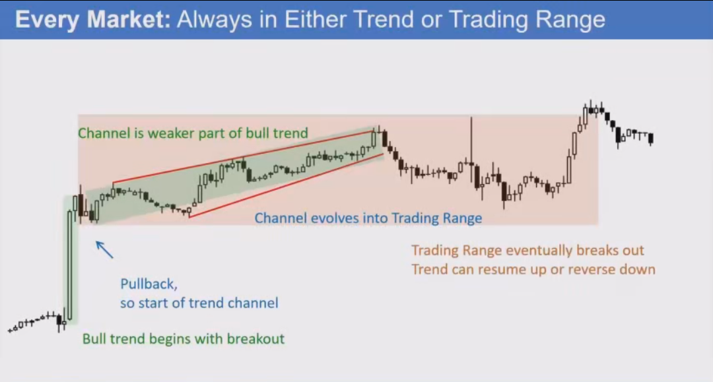

### 市场演变过程

1. **牛市趋势开始** - 以突破开始
2. **形成通道** - 回调形成趋势通道
3. **通道演变为交易区间** - 趋势减弱
4. **交易区间最终突破** - 趋势可能继续或反转

---

## 3. 支撑与阻力

### 支撑 (Support)

- 低于当前价格的价位
- 抛售可能暂停或反转的区域

### 阻力 (Resistance)

- 高于当前价格的价位
- 上涨可能停滞或反转的区域

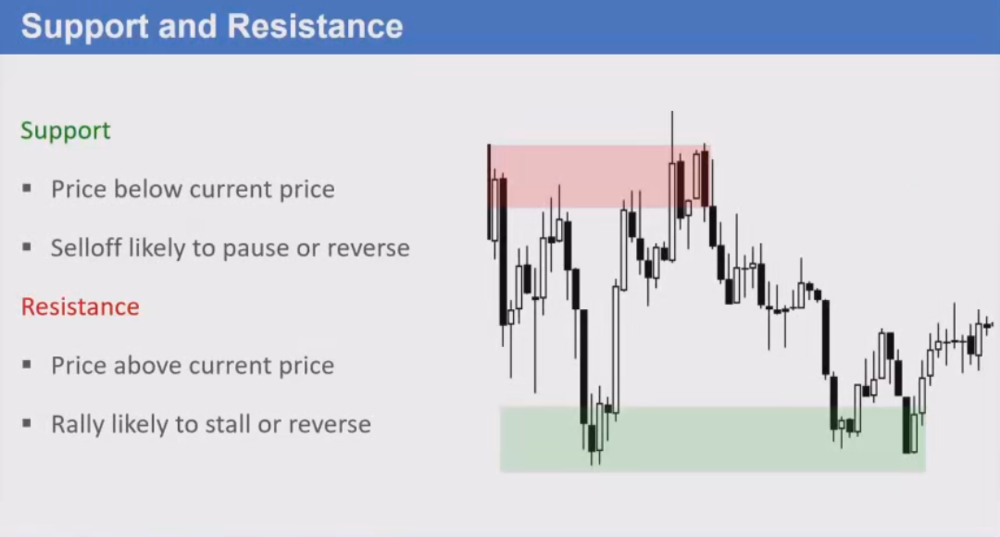

---

## 4. 突破 (Breakout)

### 定义

价格移动到支撑或阻力之外。

### 突破后的可能结果

**可能失败：**
- 回到交易区间

**可能成功：**
- 形成趋势

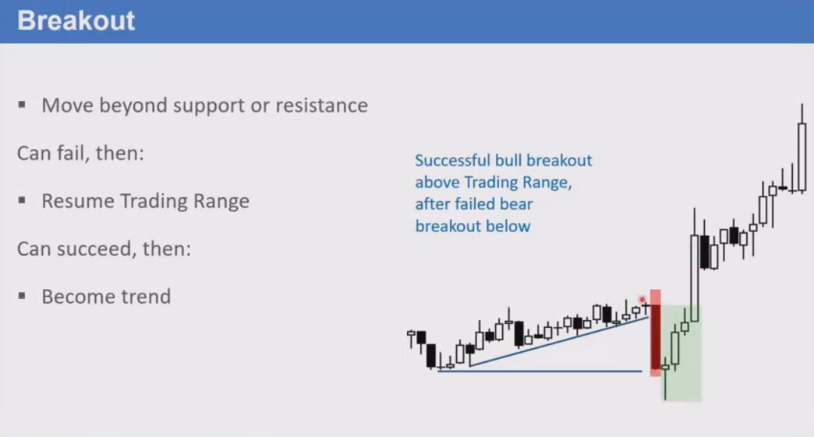

---

## 5. K线与蜡烛

### 术语说明

- 使用**蜡烛图 (Candle Charts)**
- 有时也称为**K线 (Bars)**
- **Tail / Wick / Shadow** - 都是指影线（同一个意思）

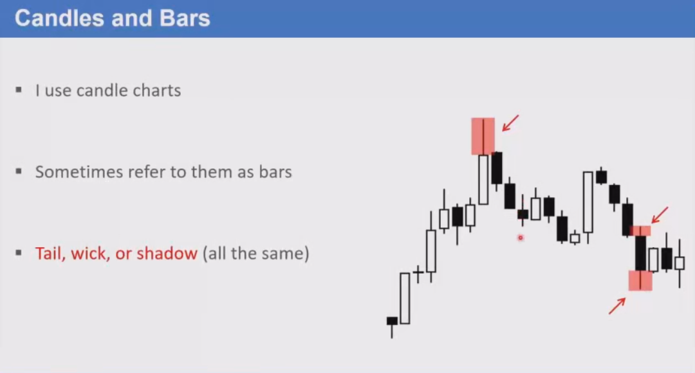

### 两种K线类型

#### 趋势K线 (Trend Bars)

- 小影线（影线短）
- 单根K线就是一个趋势

#### 交易区间K线 (Trading Range Bars)

- 也称为**十字星 (Dojis)** 或 **Doji Bars**
- 影线明显，实体小
- 单根K线就是一个交易区间

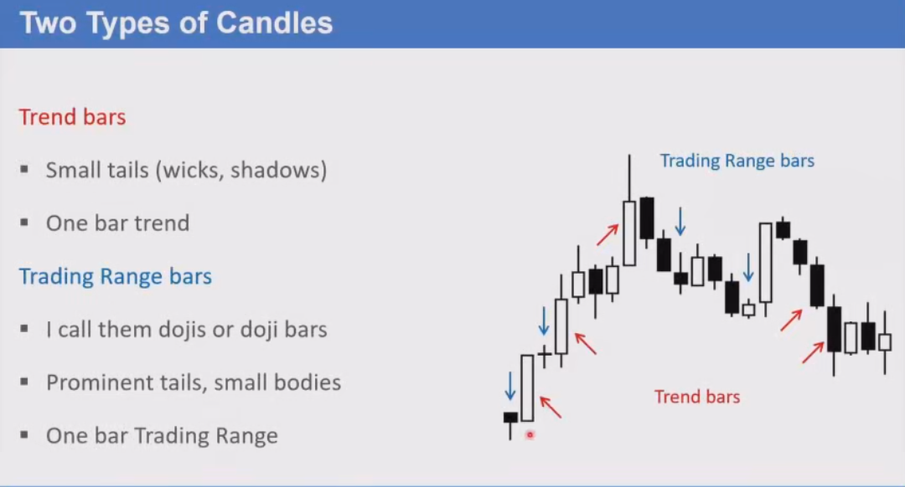

---

## 6. ABC回调

### 牛市趋势中的ABC回调 (High 2)

- 在牛市趋势中，寻找 **High 2 (H2)** 回调
- 在信号K线高点上方设置买入止损单

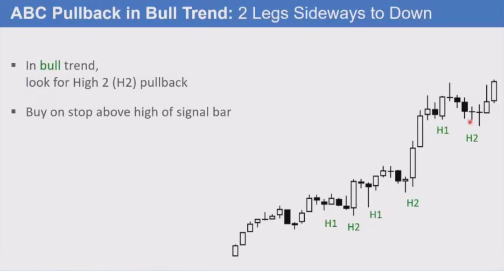

### 熊市趋势中的ABC回调 (Low 2)

- 在熊市趋势中，寻找 **Low 2 (L2)**
- 在信号K线低点下方设置卖出止损单

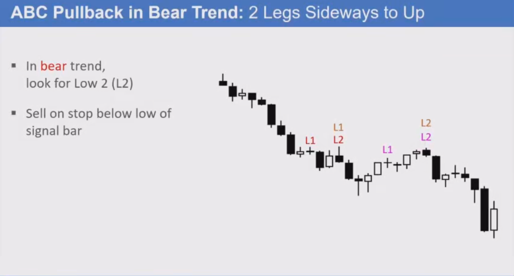

---

## 7. 内外K线

### 内包K线 (Inside Bar)

- 高点等于或低于前一根K线的高点
- 低点等于或高于前一根K线的低点

### 外包K线 (Outside Bar)

- 高点等于或高于前一根K线的高点
- 低点等于或低于前一根K线的低点

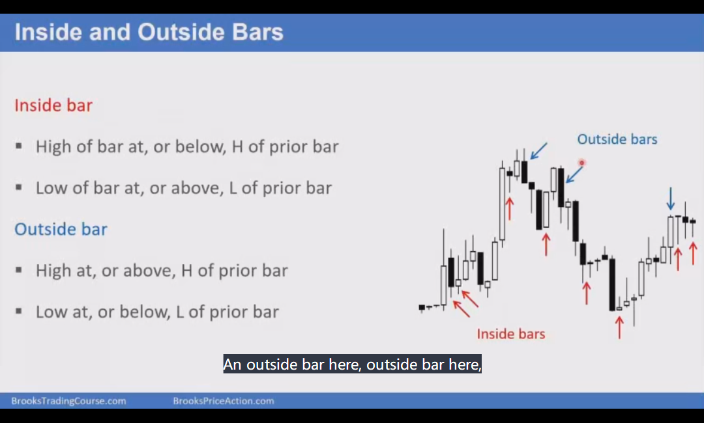

---

## 8. 背景的重要性

### 背景定义

**背景 = 左侧所有K线**

下单时必须注意背景：
- 大局观
- 当前K线左侧的所有K线

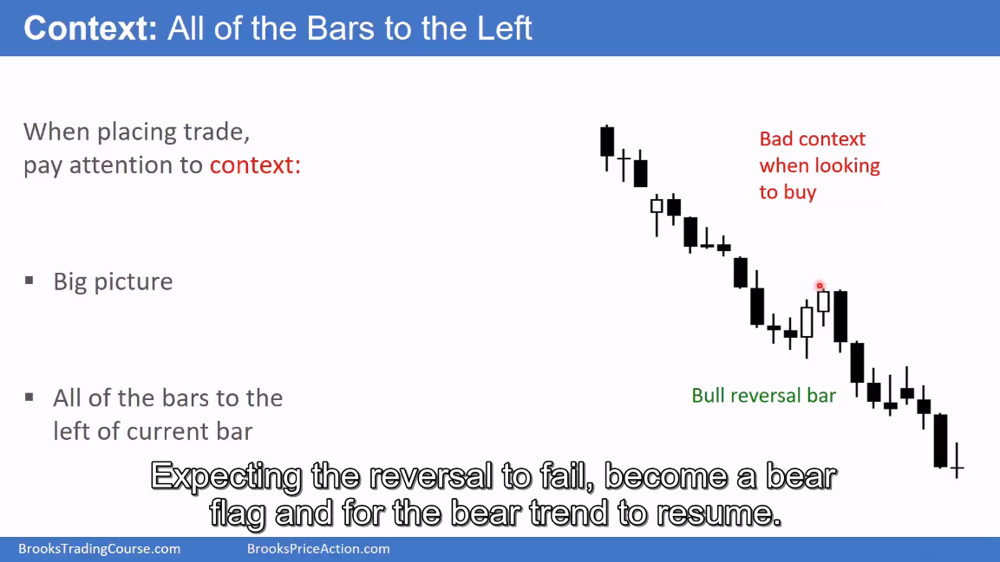

---

## 9. 始终在场 (Always In)

### 概念

始终在场是指市场一直处于多头或空头状态：

- **Always In Long (AIL)** - 始终做多状态
- **Always In Short (AIS)** - 始终做空状态

### 示例

下图展示了从 Always In Short 转变为 Always In Long 的过程：

1. 连续3根大阴线，底部有影线
2. 形成下降楔形底部 (Wedge Bottom)
3. 突破并跟随
4. 牛市突破熊市通道
5. 设置是更高低点主要趋势反转 (HL MTR) 和头肩底 (HSB)

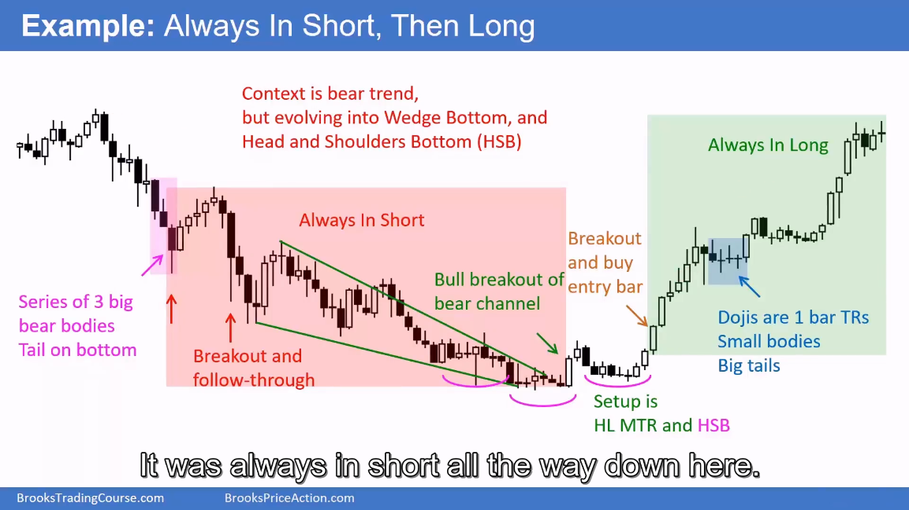

---

## 10. 技术分析与基本面分析

### 技术分析 (Technical Analysis)

- 显示价格的图表
- 价格行为就是价格如何移动

### 基本面分析 (Fundamental Analysis)

- 经济信息
- 忽略图表

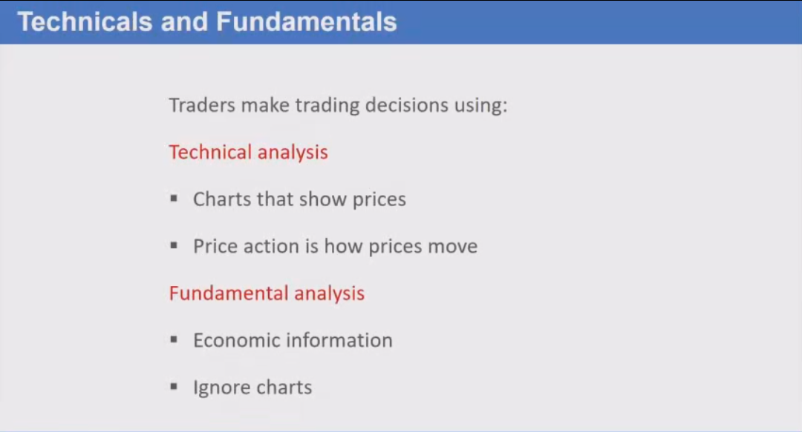

---

## 11. 程序化交易

### 特点

- 在主要市场运作
- 大部分交易是自动化的
- 订单由计算机执行
- 软件程序称为算法

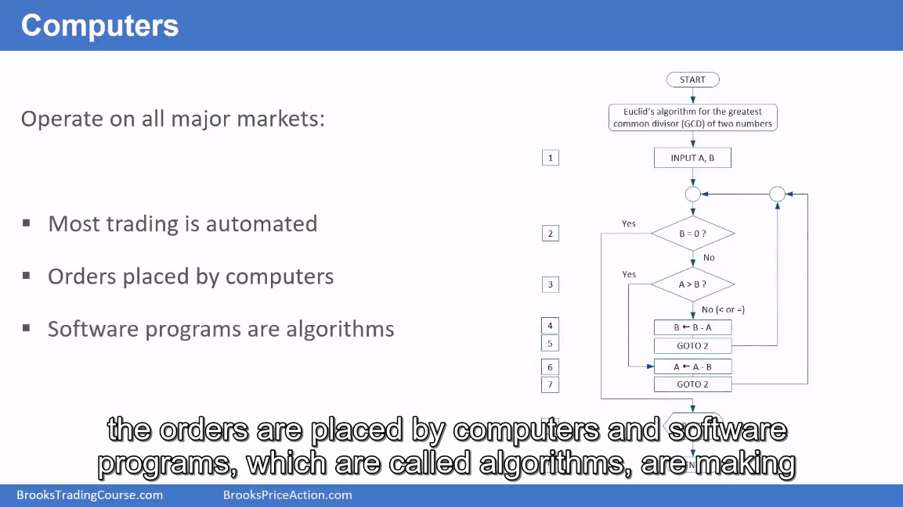

---

## 总结

掌握这些基础术语是学习 Al Brooks 价格行为交易体系的第一步。理解这些概念后，你将能够更好地阅读图表并做出交易决策。

### 关键要点

1. **市场只有两种状态** - 趋势或交易区间
2. **支撑和阻力** - 价格的关键参考点
3. **突破** - 可能成功形成趋势，也可能失败回到区间
4. **两种K线** - 趋势K线（小影线）和交易区间K线（大影线小实体）
5. **ABC回调** - H2做多，L2做空
6. **背景** - 左侧所有K线提供交易背景
