# Buying and Selling Pressure

## 一、核心概念

> 💡 **核心：价格本质由供需关系驱动 — 买单 > 卖单 = 价格上涨，卖单 > 买单 = 价格下跌**

### 1. 什么是压力？

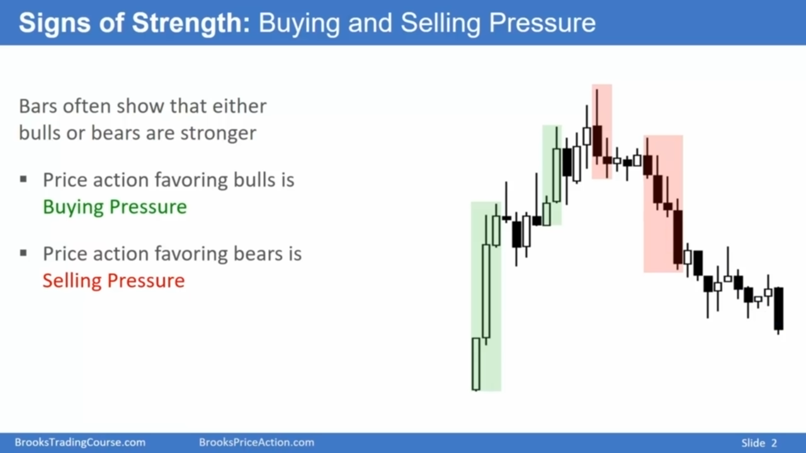

**强势迹象：买卖压力 (Signs of Strength: Buying and Selling Pressure)**

K线通常会显示多头或空头哪一方更强：
- **买入压力 (Buying Pressure)**：价格行为有利于多头
- **卖出压力 (Selling Pressure)**：价格行为有利于空头

### 2. 压力增加趋势延续的概率

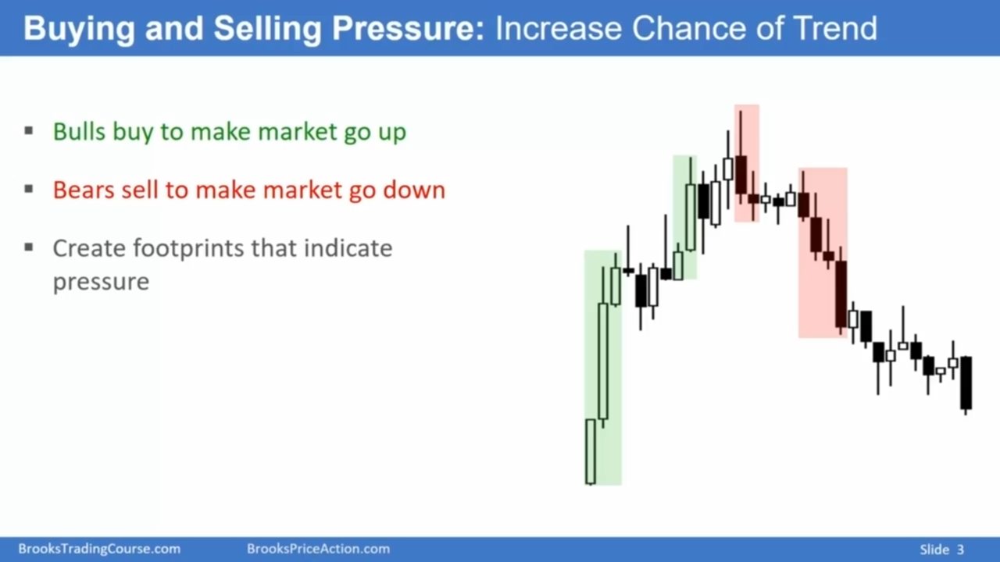

- **多头买入推动市场上涨** (Bulls buy to make market go up)
- **空头卖出推动市场下跌** (Bears sell to make market go down)
- 这些行为留下显示压力的**足迹** (Create footprints that indicate pressure)

### 3. 牛市趋势：具有买入压力

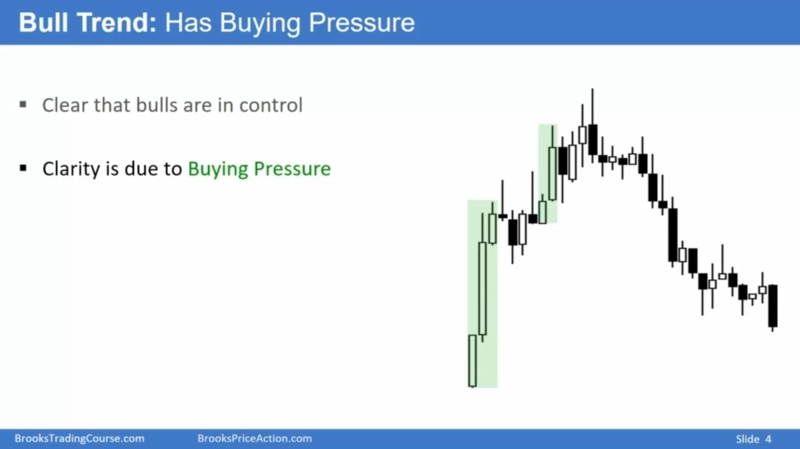

- 明显多头掌控局面 (Clear that bulls are in control)
- 清晰度源于**买入压力** (Clarity is due to Buying Pressure)

---

## 二、买入压力 (Buying Pressure)

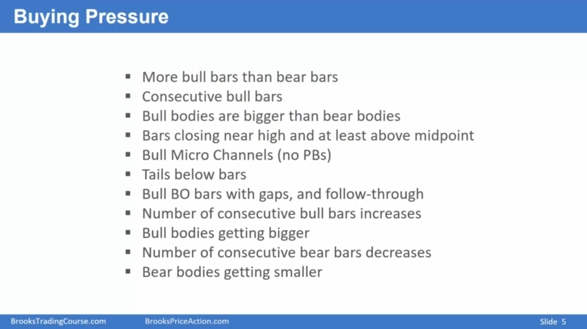

### 1. 买入压力的特征

- **多头K线多于空头K线** (More bull bars than bear bars)
- **连续多头K线** (Consecutive bull bars)
- **多头实体大于空头实体** (Bull bodies are bigger than bear bodies)
- **收盘接近高点且至少在中点之上** (Bars closing near high and at least above midpoint)
- **多头微通道（无回撤）** (Bull Micro Channels, no PBs)
- **K线下影线** (Tails below bars)
- **多头突破K线带缺口和跟进** (Bull BO bars with gaps, and follow-through)
- **连续多头K线数量增加** (Number of consecutive bull bars increases)
- **多头实体变大** (Bull bodies getting bigger)
- **连续空头K线数量减少** (Number of consecutive bear bars decreases)
- **空头实体变小** (Bear bodies getting smaller)

### 2. 买入压力：连续多头K线

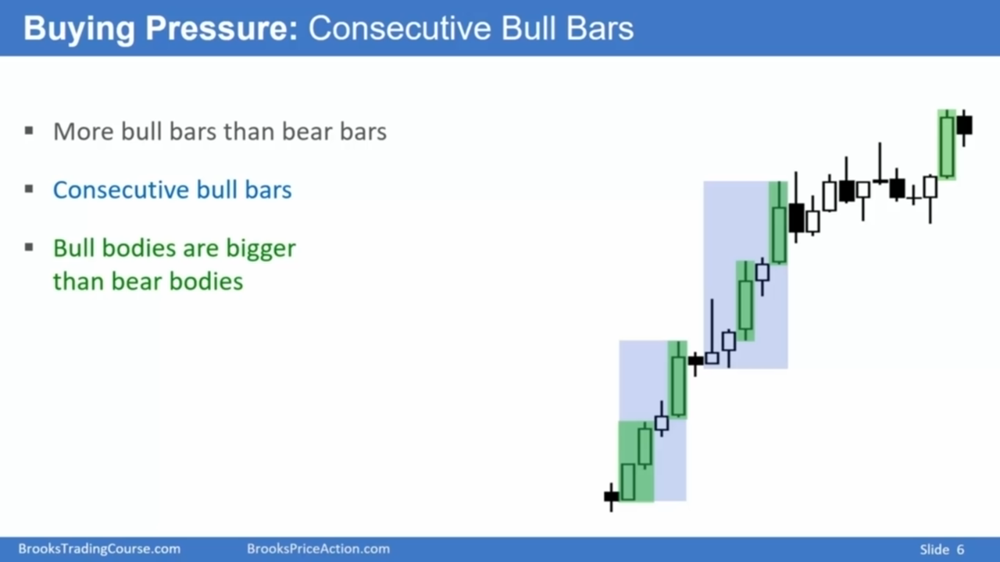

- **多头K线多于空头K线** (More bull bars than bear bars)
- **连续多头K线** (Consecutive bull bars)
- **多头实体大于空头实体** (Bull bodies are bigger than bear bodies)

### 3. 买入压力：强劲多头K线

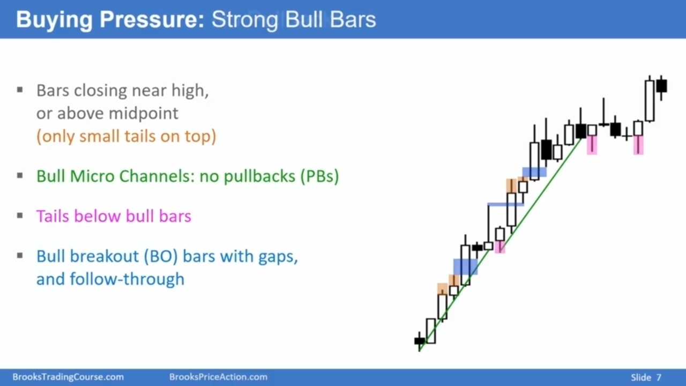

- **收盘接近高点，或在中点之上（仅顶部小影线）** (Bars closing near high, or above midpoint, only small tails on top)
- **多头微通道：无回撤** (Bull Micro Channels: no PBs)
- **K线下影线** (Tails below bars)
- **多头突破K线带缺口和跟进** (Bull breakout bars with gaps, and follow-through)

### 4. 买入压力：无回撤

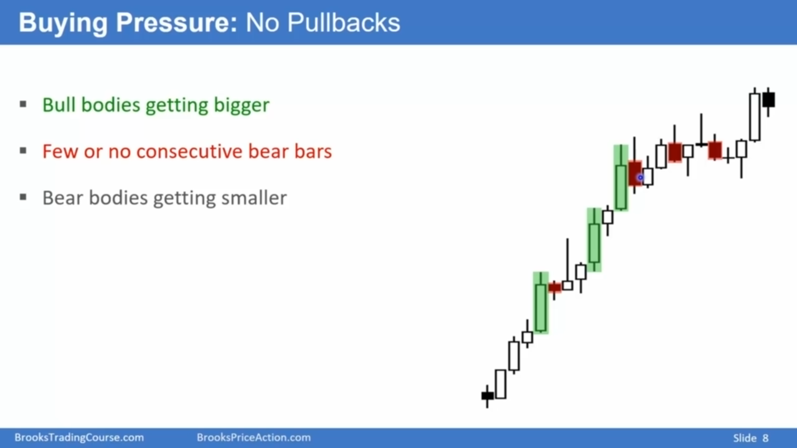

- **多头实体变大** (Bull bodies getting bigger)
- **极少或无连续空头K线** (Few or no consecutive bear bars)
- **空头实体变小** (Bear bodies getting smaller)

---

---

## 三、卖出压力 (Selling Pressure)

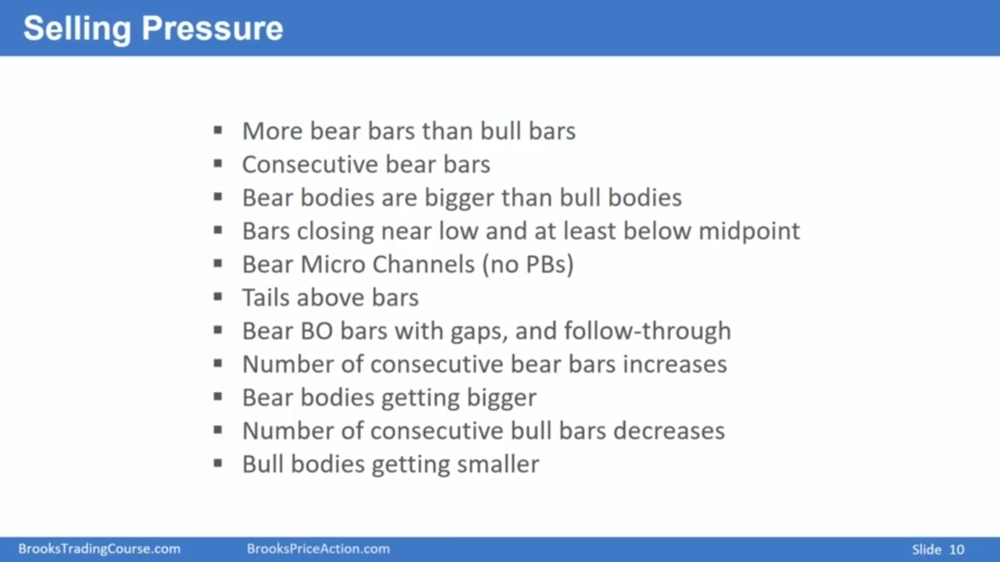

### 1. 卖出压力的特征

- **空头K线多于多头K线** (More bear bars than bull bars)
- **连续空头K线** (Consecutive bear bars)
- **空头实体大于多头实体** (Bear bodies are bigger than bull bodies)
- **收盘接近低点且至少在中点之下** (Bars closing near low and at least below midpoint)
- **空头微通道（无回撤）** (Bear Micro Channels, no PBs)
- **K线上影线** (Tails above bars)
- **空头突破K线带缺口和跟进** (Bear BO bars with gaps, and follow-through)
- **连续空头K线数量增加** (Number of consecutive bear bars increases)
- **空头实体变大** (Bear bodies getting bigger)
- **连续多头K线数量减少** (Number of consecutive bull bars decreases)
- **多头实体变小** (Bull bodies getting smaller)

### 2. 熊市趋势：具有卖出压力

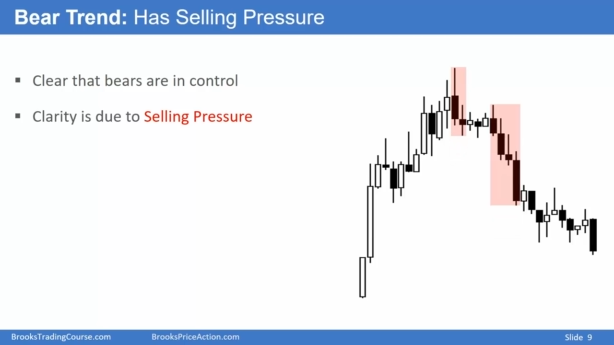

- 明显空头掌控局面 (Clear that bears are in control)
- 清晰度源于**卖出压力** (Clarity is due to Selling Pressure)

### 3. 卖出压力：连续空头K线

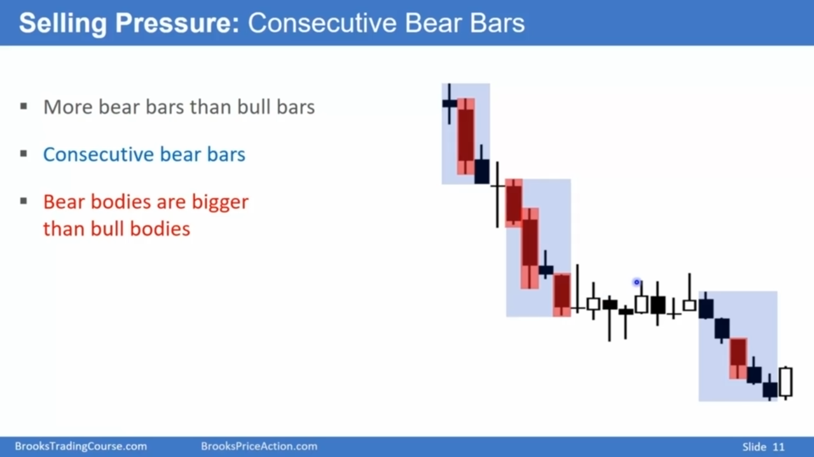

- **空头K线多于多头K线** (More bear bars than bull bars)
- **连续空头K线** (Consecutive bear bars)
- **空头实体大于多头实体** (Bear bodies are bigger than bull bodies)

### 4. 卖出压力：强劲空头K线

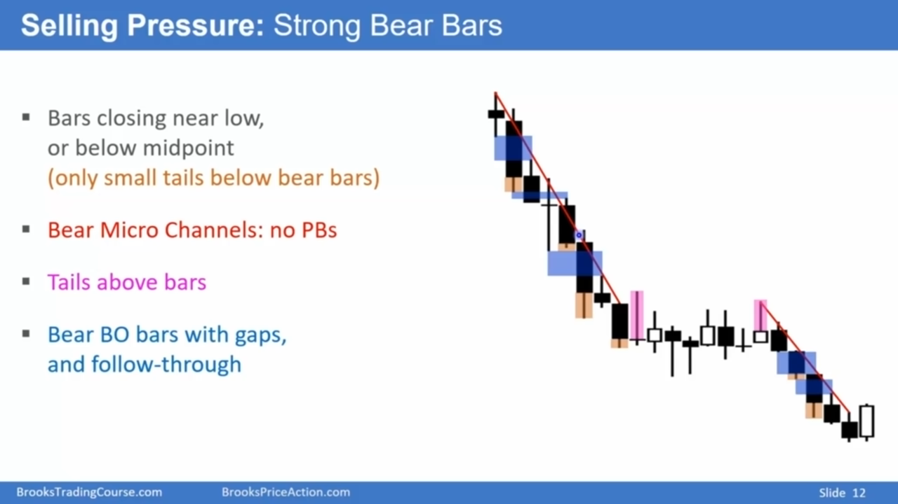

- **收盘接近低点，或在中点之下（仅底部小影线）** (Bars closing near low, or below midpoint, only small tails below bear bars)
- **空头微通道：无回撤** (Bear Micro Channels: no PBs)
- **K线上影线** (Tails above bars)
- **空头突破K线带缺口和跟进** (Bear BO bars with gaps, and follow-through)

### 5. 卖出压力：无回撤

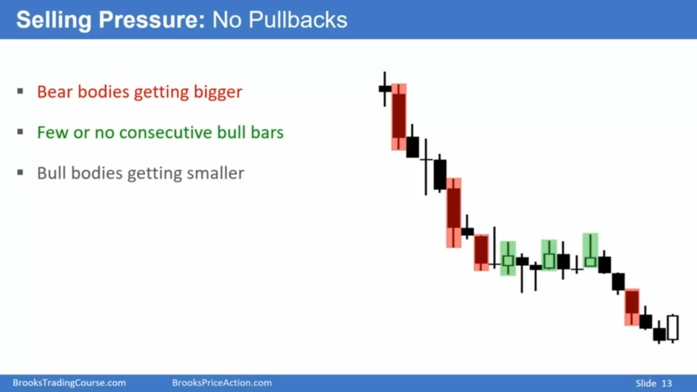

- **空头实体变大** (Bear bodies getting bigger)
- **极少或无连续多头K线** (Few or no consecutive bull bars)
- **多头实体变小** (Bull bodies getting smaller)

---

## 四、谁主导K线与市场？(Who Owns the Bar/Market?)

### 1. 谁主导K线？

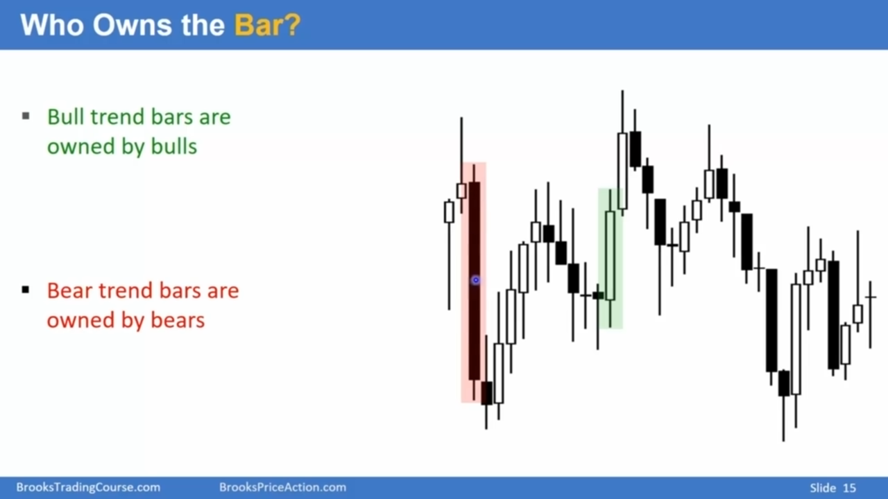

- **牛市趋势K线由多头主导** (Bull trend bars are owned by bulls)
- **熊市趋势K线由空头主导** (Bear trend bars are owned by bears)

### 2. 谁主导市场？

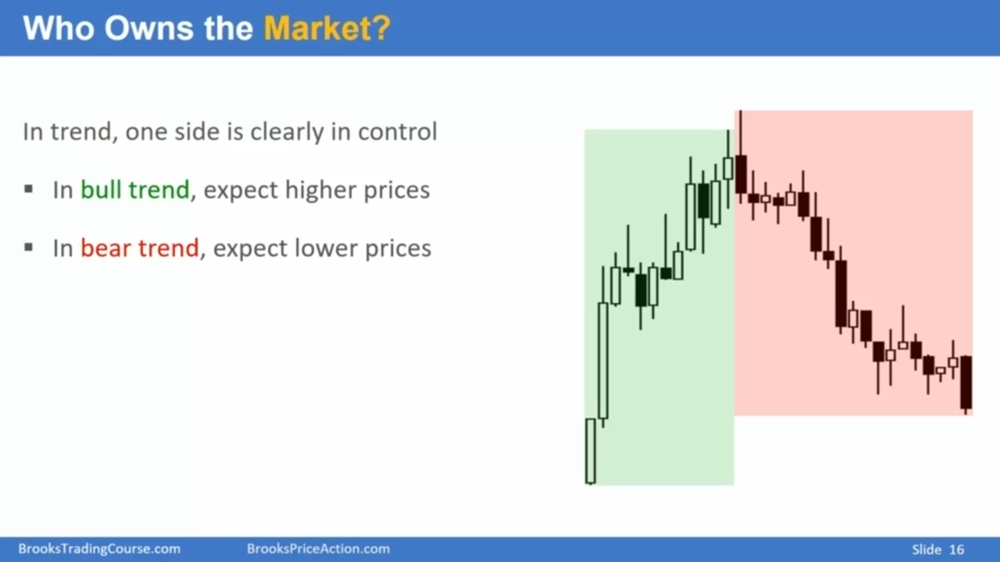

在趋势中，一方明显掌控局面：
- **牛市趋势中，预期更高价格** (In bull trend, expect higher prices)
- **熊市趋势中，预期更低价格** (In bear trend, expect lower prices)

---

## 五、交易区间 (Trading Range)

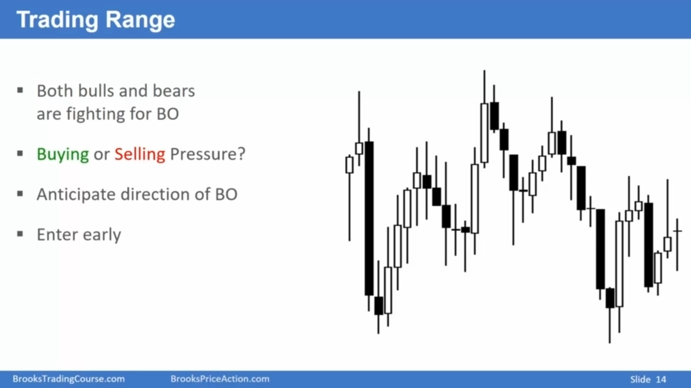

### 1. 交易区间的特征

- 多头和空头都在争夺突破 (Both bulls and bears are fighting for BO)
- **买入还是卖出压力？** (Buying or Selling Pressure?)
- 预判突破方向 (Anticipate direction of BO)
- 提前入场 (Enter early)

### 2. 交易区间：关注增加的买入压力

- 连续多头K线 (Consecutive bull bars)
- 多头K线变大 (Bull bars bigger)
- 收盘在高点 (Close on high)
- 更多多头K线、缺口 (More bull bars, gaps)
- 更高高点和低点 (Higher Highs and Lows)
- 概率开始有利于多头突破 (Odds beginning to favor bull BO)

### 3. 交易区间：关注增加的卖出压力

- 5个连续多头K线后，不再有更多连续多头K线
- 多头K线变小
- 更低高点和低点 (LH MTR, HST)
- 缺口：收盘低于40根K线低点
- 6个连续空头K线，建立卖出压力

---

## 六、跳空缺口 (Gaps)

### 1. 缺口要点

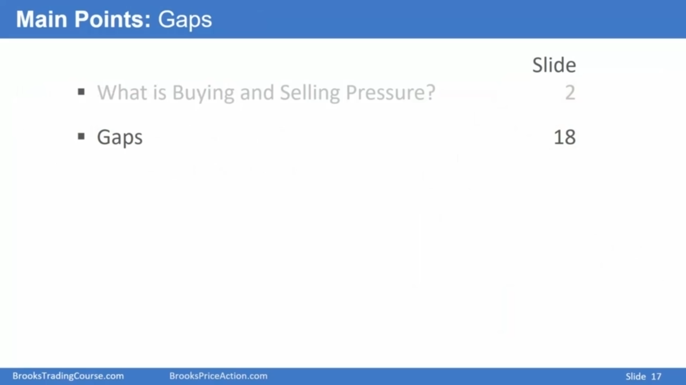

主要内容：
- 什么是买卖压力？(What is Buying and Selling Pressure?) - Slide 2
- 缺口 (Gaps) - Slide 18

### 2. 传统向上缺口

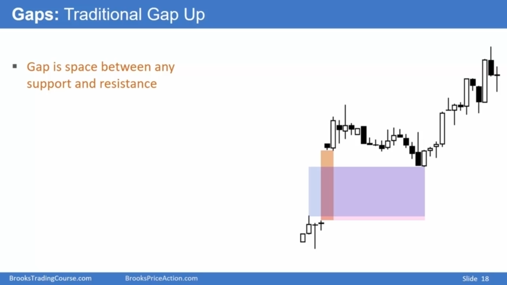

- **缺口是任何支撑和阻力之间的空间** (Gap is space between any support and resistance)

图表显示传统跳空高开的形态，缺口位于支撑位和阻力位之间。

### 3. 负向向上缺口

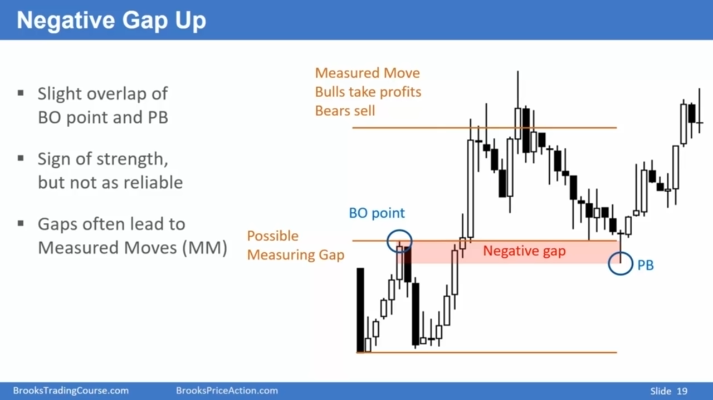

- 突破点和回撤有轻微重叠 (Slight overlap of BO point and PB)
- 强势迹象，但可靠性不如完全缺口 (Sign of strength, but not as reliable)
- 缺口通常导致测量移动 (Gaps often lead to Measured Moves)

图表元素：
- 测量移动 (Measured Move)：多头获利了结，空头卖出
- 突破点 (BO point)
- 负向缺口 (Negative gap)
- 可能的测量缺口 (Possible Measuring Gap)
- 回撤 (PB)

### 4. 容易被忽视的缺口（向上）

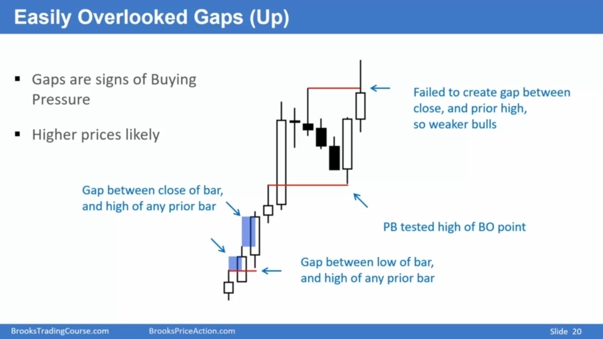

- **缺口是买入压力的迹象** (Gaps are signs of Buying Pressure)
- **更高价格可能** (Higher prices likely)

缺口类型：
- K线收盘与之前任何K线高点之间的缺口
- K线低点与之后任何K线高点之间的缺口
- 突破点被回撤测试
- 未能在收盘与前高之间形成缺口，表明多头较弱

### 5. 传统向下缺口

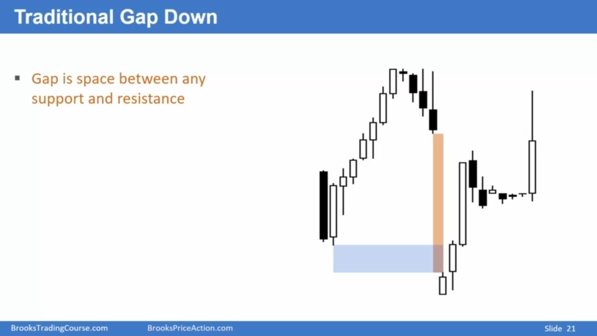

- **缺口是任何支撑和阻力之间的空间** (Gap is space between any support and resistance)

图表显示传统跳空低开的形态。

### 6. 负向向下缺口

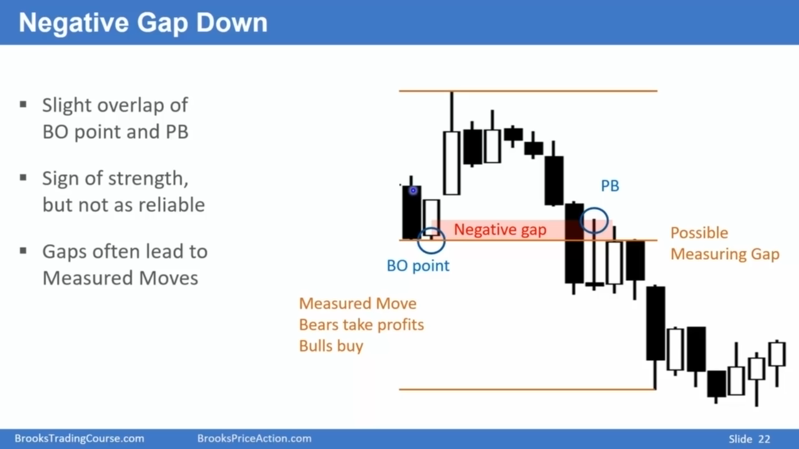

- 突破点和回撤有轻微重叠 (Slight overlap of BO point and PB)
- 强势迹象，但可靠性不如完全缺口 (Sign of strength, but not as reliable)
- 缺口通常导致测量移动 (Gaps often lead to Measured Moves)

### 7. 容易被忽视的缺口（向下）

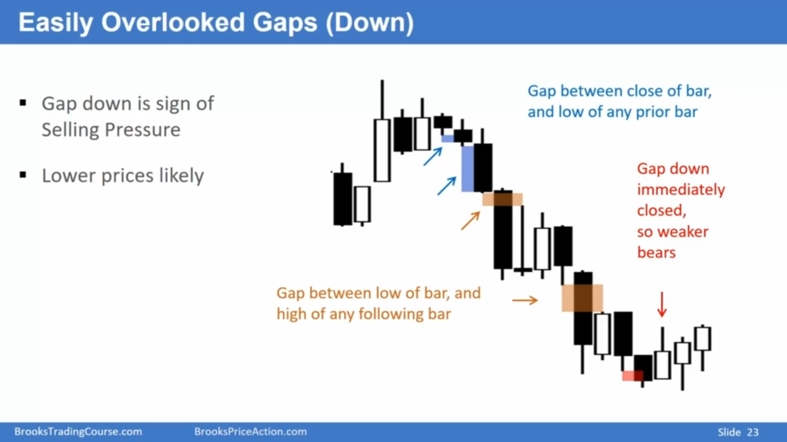

- **向下缺口是卖出压力的迹象** (Gap down is sign of Selling Pressure)
- **更低价格可能** (Lower prices likely)

缺口类型：
- K线收盘与之前任何K线低点之间的缺口
- K线低点与之后任何K线高点之间的缺口
- 立即回补的向下缺口表明空头较弱

---

## 七、通道与交易区间的演变

### 1. 牛市通道中的卖出压力：即将进入交易区间

- 回撤和紧密交易区间 (TTR)，因此存在一些卖出
- 如果牛市通道出现**增加的卖出压力**，可能很快会变成交易区间 (TR)

### 2. 牛市通道中的卖出压力：预期交易区间

图表显示牛市通道演变为楔形空头旗形 (Wedge Bear Flag)。

### 3. 通道演变为交易区间

图表展示牛市通道如何演变为交易区间。

### 4. 牛市通道中的卖出压力：即将进入交易区间（另一示例）

- 无连续强劲多头K线
- 跟进不佳
- 交易区间比牛市趋势更可能
- 连续大空头K线收盘在低点
- 缺口（收盘低于前一根K线）

### 5. 熊市趋势中的买入压力：即将进入交易区间

- 如果熊市通道出现**增加的买入压力**，可能很快会变成交易区间
- 许多多头K线
- K线下影线
- 大空头K线后跟进不佳

### 6. 熊市趋势中的买入压力：预期交易区间

- 收盘高于过去15根K线高点
- 多头突破高于熊市通道，且高于Low 2 Bear Flag
- 买入收盘，或等待跟进后买入

---

## 八、熊通道是牛旗

- 买入突破K线收盘或跟进K线 (Buy close of BO bar or follow-through bar)
- 买入多头和空头收盘 (Buy bull and bear closes)
- 在K线上方和下方买入 (Buy below and above bars)

---

## 九、总结

买卖压力是Al Brooks价格行为交易系统的核心概念：

1. **买入压力的特征**：
   - 连续多头K线
   - 多头实体变大
   - 收盘接近高点
   - 无回撤或浅回撤
   - 缺口出现

2. **卖出压力的特征**：
   - 连续空头K线
   - 空头实体变大
   - 收盘接近低点
   - 无回撤或浅回撤
   - 缺口出现

3. **缺口类型**：
   - 传统缺口
   - 负向缺口
   - 容易被忽视的缺口

4. **通道与交易区间**：
   - 通道中出现反向压力预示可能演变为交易区间
   - 识别压力变化可以提前预判市场结构转变

掌握买卖压力的识别和应用，是成为成功价格行为交易者的关键一步。

---

